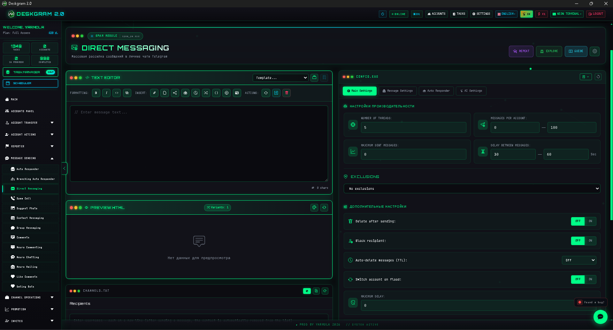
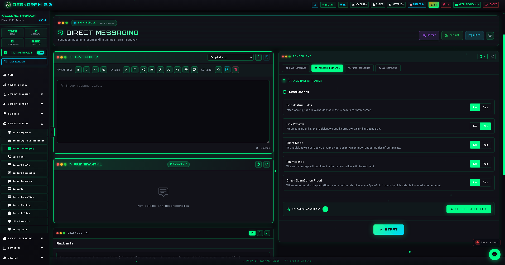
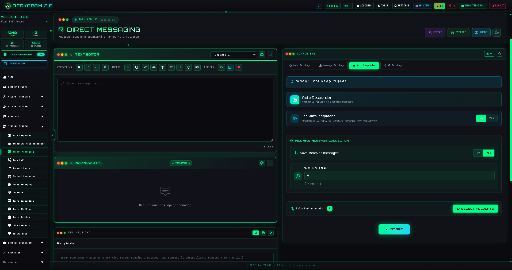
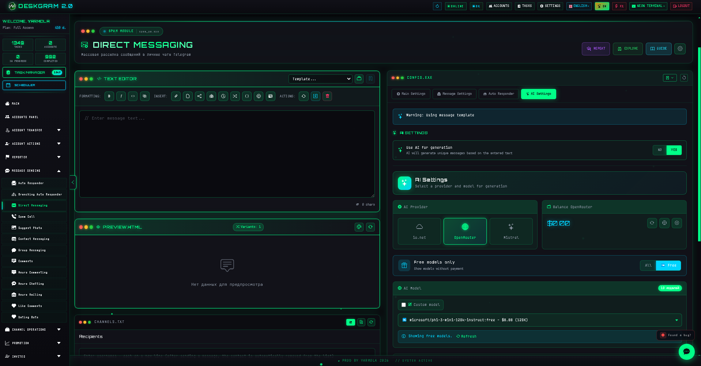

# Telegram Direct Messaging with Deskgram 2

Direct Messaging is a Deskgram 2 module for sending messages into Telegram private chats at scale. It combines delivery settings, limits, delays, autoresponder logic, AI text generation, and execution control inside one interface.

[Deskgram 2 Hub](https://github.com/Deskgram-2/deskgram-2-telegram-automation-en) · [Website](https://deskgram2.com/) · [Telegram Bot](https://t.me/DG2welcomebot) · [Web Preview](https://deskgram2.com/web-preview)

## About the module

| Parameter | What is inside |
|---|---|
| Main task | Bulk messaging to Telegram private chats |
| Content support | Text, media, reposts, stories, and constructor-based formats |
| Extra layers | Autoresponder, scheduling, AI rewrite and generation |
| Useful for | Lead generation, warmup flows, follow-up communication |
| Related modules | Audience Parser, Join Groups, Neuro Chatting |

## What it can do

- send messages into Telegram private chats;
- work from a prepared recipient base;
- configure threads, limits, and delays;
- use AI for message generation or rewriting;
- connect autoresponder logic after the initial send;
- keep statistics and execution logs;
- handle exclusions and blacklist logic.

## Quick start

1. Prepare a recipient list.
2. Build the message in the constructor.
3. Configure threads, limits, and delays.
4. Enable AI or autoresponder logic if needed.
5. Assign accounts and launch the task.

## What to connect with this workflow

- [Audience Parser](https://github.com/Deskgram-2/telegram-audience-parser-deskgram-en) if the recipient base is not ready yet.
- [Account Manager](https://github.com/Deskgram-2/telegram-account-manager-deskgram-en) if you need to organize the account grid first.
- [Proxy Manager](https://github.com/Deskgram-2/telegram-proxy-manager-deskgram-en) if the campaign depends on a stable infrastructure layer.
- [Automation Settings](https://github.com/Deskgram-2/telegram-automation-settings-deskgram-en) if AI and shared parameters are part of the scenario.
- [Join Groups](https://github.com/Deskgram-2/telegram-join-groups-deskgram-en) if accounts must enter the target environment before messaging.

## What this outreach route often expands into

- [Invite Tool](https://github.com/Deskgram-2/telegram-invite-tool-deskgram-en) if messaging sits inside a larger growth workflow.
- [Task Manager](https://github.com/Deskgram-2/telegram-task-manager-deskgram-en) if you want one control layer for execution, failures, and pacing.
- [Neuro Commenting](https://github.com/Deskgram-2/telegram-neuro-commenting-deskgram-en) if direct messaging is only one part of a broader engagement system.

## Interface highlights

### Send options

### Autoresponder

### AI settings

## When it is especially useful

- when you need a structured Telegram outreach flow from a collected audience base;
- when follow-up logic matters after the first message;
- when text variation is important for repetitive campaigns;
- when you want visible pacing, status tracking, and logs.

## Why it is more convenient than manual messaging

| Manual approach | Direct Messaging in Deskgram 2 |
|---|---|
| Sending is slow and repetitive | The workflow is multi-threaded |
| Limits are hard to manage | Limits and delays are configured up front |
| There is no shared campaign-level visibility | Logs and statistics are built in |
| Follow-up replies are easy to lose | Autoresponder logic can continue the flow |
| Text becomes repetitive fast | AI helps vary and adapt the message |

## What to choose: Direct Messaging or Neuro Mailing

| If your goal is | Better fit |
|---|---|
| Run structured outreach with clear control over bulk sends | [Direct Messaging](https://github.com/Deskgram-2/telegram-direct-messaging-deskgram-en) |
| Build a more conversational AI layer in private chats | [Neuro Mailing](https://github.com/Deskgram-2/telegram-neuro-mailing-deskgram) |
| Touch the full base first and deepen conversations later | Direct Messaging first, then Neuro Mailing |
| Mix controlled execution with AI follow-up | Use both modules in one route |

## Scenario FAQ

### When should I use a broad audience base and when should I use a warmer one?

A broad base from [Audience Parser](https://github.com/Deskgram-2/telegram-audience-parser-deskgram-en) is useful for scale. A warmer base from [Comment Audience Parser](https://github.com/Deskgram-2/telegram-comment-audience-parser-deskgram) is usually better when response quality matters more than raw reach.

### When is AI worth enabling here?

AI is most useful when you need more wording variation, softer phrasing, or better segmentation across the recipient base. If the offer is simple and tightly controlled, a standard message can be enough.

### When is autoresponder optional and when is it essential?

If the campaign only needs a first touch, autoresponder can stay optional. If the goal includes follow-up handling, reply capture, and deeper conversation, it should be part of the setup from the beginning.

## Related repositories

- [Deskgram 2 Hub](https://github.com/Deskgram-2/deskgram-2-telegram-automation-en)
- [Audience Parser](https://github.com/Deskgram-2/telegram-audience-parser-deskgram-en)
- [Join Groups](https://github.com/Deskgram-2/telegram-join-groups-deskgram-en)
- [Account Manager](https://github.com/Deskgram-2/telegram-account-manager-deskgram-en)
- [Proxy Manager](https://github.com/Deskgram-2/telegram-proxy-manager-deskgram-en)
- [Automation Settings](https://github.com/Deskgram-2/telegram-automation-settings-deskgram-en)
- [Invite Tool](https://github.com/Deskgram-2/telegram-invite-tool-deskgram-en)
- [Task Manager](https://github.com/Deskgram-2/telegram-task-manager-deskgram-en)
- [Neuro Commenting](https://github.com/Deskgram-2/telegram-neuro-commenting-deskgram-en)

## FAQ

### Can I use my own text without AI?

Yes. AI is optional, not required.

### Can I collect replies from users?

Yes. That is one of the natural next steps through autoresponder scenarios.
